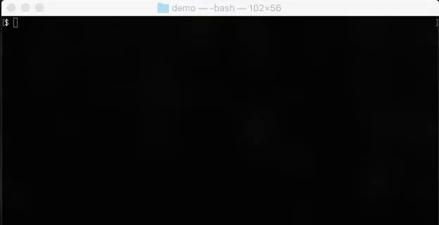

# Microsoft Office Add-in Manifest Validator

[](http://badge.fury.io/js/office-addin-validator)
[](https://npmjs.org/package/office-addin-validator)
[](https://travis-ci.org/OfficeDev/office-addin-validator)

This validator is designed to help ensure that the manifest file that describes your Office Add-in is correct and complete. Microsoft includes [rich development and validation tools for Office related projects in Visual Studio 2015](http://aka.ms/OfficeDevToolsForVS2015). Similarly, this command-line validator helps developers:
* Get insight on common failure points in manifest
* Understand against what platforms to test your add-in
* Stay up-to-date on store requirements, etc.

This validator calls into the same validation service as the Office store, so that developers get the most up-to-date and accurate feedback from Office. The manifest checks done by the service include:
* Checks for mandatory namespaces
* XML schema validation
* Office App Compatibility checks (e.g. checking if urls are HTTPS)

> **Note:** Because it calls into the store, you must be connected to the internet in order to use this tool.

If you are interested in contributing, read the [Contributing Guidelines](CONTRIBUTING.md). 

## Installation
> **Important:** If this is the first time you're using this tool, first install [Node.js](https://nodejs.org). For developers on Mac, we recommend using [Node Version Manager](https://github.com/creationix/nvm) to install Node.js with the right permissions. When the installation completes, restart your console (or if you are using Windows, restart your machine) to ensure you use the updated system environment variables.

Install `office-addin-validator` globally using [NPM](http://npmjs.org/):
```bash
npm install -g office-addin-validator
```

## Usage
```bash
$ validate-office-addin your_manifest.xml
```

> **Note:** At this time, we only support validation on manifest files that lives on your local drive.

Copyright (c) 2017 Microsoft Corporation. All rights reserved.